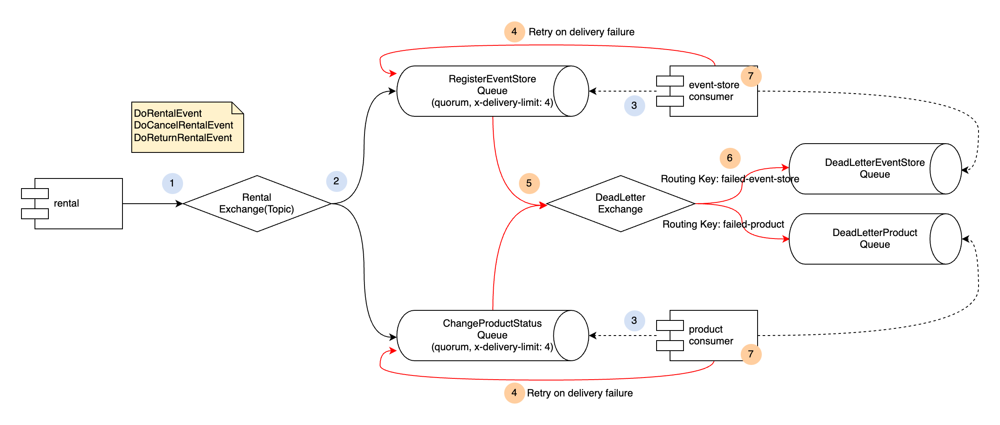

# rabbit-mq

### 개발환경
- Spring Boot 3.1.0
- Spring MVC
- Spring AMQP
- Spring Data Jpa [rental, product]
- Mybatis 3 [event-store]
- Java 17
- H2

### MODULE

### API

[렌탈 요청]
- POST http://localhost:8060/api/rentals
  - -H ContentType: application/json

[렌탈 취소 요청]
- PATCH http://localhost:8060/api/rentals/{rentalId}/cancel
  - -H ContentType: application/json

[렌탈 반납 요청]
- PATCH http://localhost:8060/api/rentals/{rentalId}/return
  - -H ContentType: application/json

[상품 조회]
- GET http://localhost:8050/api/products/{productId}

[이벤트 목록 조회]
- GET http://localhost:8040/api/events
  - query parameters
    - *type : 이벤트 타입
    - *startDate : 발행 시작일
    - *endDate : 발행 종료일

### 로컬 테스트 RabbitMQ
    # 볼륨 생성 (최초)
    $ docker volume create rabbitmq_data

    docker run --name rabbitmq -d \
    -v rabbitmq_data:/var/lib/rabbitmq \
    -p 15672:15672 \
    -p 5672:5672 \
    -e RABBITMQ_DEFAULT_USER=ysrabbit \
    -e RABBITMQ_DEFAULT_PASS=ysrabbit \
    rabbitmq:3-management
